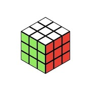

**CMSI 185** Computer Programming, Fall 2016

# Assignment 1101
From nouns (expressions) we shift to verbs (statements), and the range of things you can code up jumps by another level. As before, you have your own repository for this one and may not share work with others.

## Background Reading
- Read Chapter 4 of the textbook for additional and in-depth coverage of the material covered by this assignment.
- As an epilogue of sorts to the Programming Data assignment, read this: [A JavaScript journey with only six characters](http://jazcash.com/a-javascript-journey-with-only-six-characters/). One of the questions below will involve this article.
- [JavaScript and your Brain](https://www.youtube.com/watch?v=cIOIyfRoGcM), a recorded presentation by renowned JavaScript author Douglas Crockford, around 37 minutes long. Watch it until the end—the Q&A section has some good stuff too.
- [The Real Computer Revolution Hasn't Happened Yet](http://www.vpri.org/pdf/m2007007a_revolution.pdf) by Alan Kay. This was written in 2007, and you are learning computer programming in 2016. Focus on how things have changed (or not) since then.

## Automated Feedback Setup
In order to connect your repository to our automated code review and feedback system, once you are up and running please send your repository’s URL to Ed Seim. You can either find him in person in the lab, tweet him at [https://twitter.com/SirSeim](https://twitter.com/SirSeim), or mention him in a GitHub comment (`SirSeim`). Once he has you hooked up, the system will provide feedback on code formatting and quality whenever you commit a new version to GitHub. _Points will be deducted if issues here linger in the final submission._

## For Submission

### Exercises
(work in progress; stand by)

### Warm-Up Programs

Write the following programs. Provide your code in the files specified.

1. Write a Khan Academy program that draws a faux Rubik’s Cube in the drawing area in isometric 3D. i.e., Draw 9 identical parallelograms apiece for the three faces that one would see. Something like this:

    

    Submit this program to this repository as _isometric-rubiks-cube.js_. _Do *not* use 27 separate parallelogram-drawing statements._
1. Read up on how to use the `select` and `option` elements in HTML. Write a JSFiddle web page that displays a `select` dropdown menu listing ten (10) countries of your choice. When the user selects a country, have the web page display that country’s emoji flag and capital city. _Do *not* use an `if` statement to determine this information._

### Stretch Programs

Write the following programs. Provide your code in the files specified.

1. Write a Khan Academy program that renders an animated “precipitation” scene of your choice. Ideas include snowflakes, raindrops, hail, a sharknado, etc. When a precipitation “particle” lands on the ground, reset it so that it starts back at the top of the screen on the next frame. Submit this program to this repository as _precipitation.js_.
1. Write a “guess the number” web page game in JSFiddle. Start with having the computer choose a random integer from zero to 99. Give the web page an `input` element and a _Guess_ button. Whenever the user clicks the _Guess_ button, the program states whether the number in the `input` element is higher or lower than the target integer. Or, if the user has guessed right, the program issues an appropriately celebratory message. Reloading/rerunning the page starts the program over. Submit this program to this repository as _guess.html_ and _guess.js_. Providing _guess.css_ is encouraged but not necessary.

### Questions

Answer the following questions. Provide these answers in a file called _questions.md_ (use the previous template for the _programming-data_ assignment). As before, use the [Markdown (`.md`) format](https://guides.github.com/features/mastering-markdown/). If you need help with Markdown, ask me or any of the TAs. Recall also that the assignment writeups you’ve seen so far are written with Markdown, so you can also use those as examples for how to do certain things.

1. _Programming data epilogue_: After reading [A JavaScript journey with only six characters](http://jazcash.com/a-javascript-journey-with-only-six-characters/), (a) State the JavaScript language “trick” that the article uses to coax any JavaScript code out of just six of its characters, and (b) Express whether you think this is a flaw or feature of the JavaScript programming language.
1. (similar textbook Chapter 4 Exercise 18) Under what circumstances would it be better to use a `while` statement over `do-while` and vice versa, and why?
1. Here is another programmer joke: _A programmer goes to the shop to buy some milk. Her spouse calls and says “While you’re out, get some eggs.” She never returns._
    1. Why this is funny (or supposed to be funny)?
    1. Why do you need to be a programmer to appreciate this joke?
